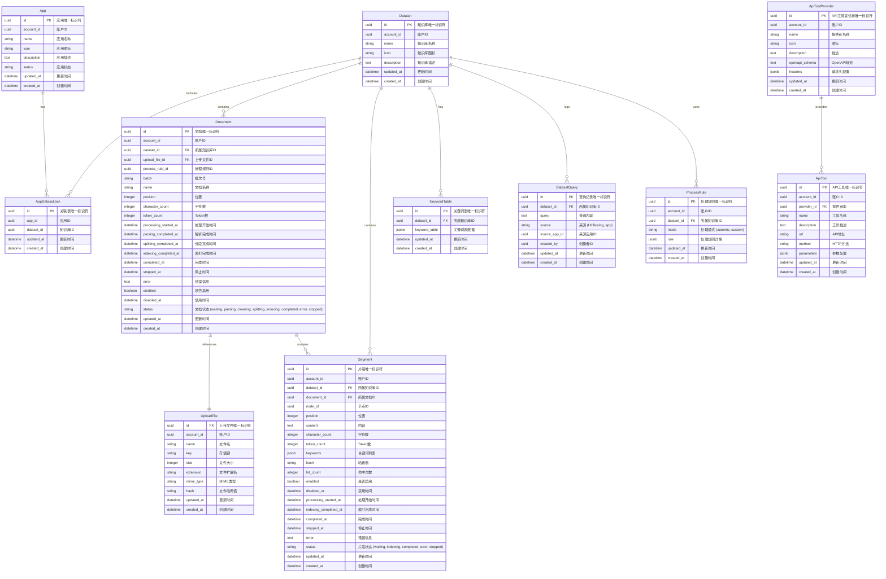

```mermaid
erDiagram
    App ||--o{ AppDatasetJoin : has
    Dataset ||--o{ AppDatasetJoin : includes
    Dataset ||--o{ Document : contains
    Dataset ||--o{ Segment : contains
    Dataset ||--o{ KeywordTable : has
    Dataset ||--o{ DatasetQuery : logs
    Dataset ||--o{ ProcessRule : uses
    Document ||--|| UploadFile : references
    Document ||--o{ Segment : contains
    ApiToolProvider ||--o{ ApiTool : provides

    App {
        uuid id PK "应用唯一标识符"
        uuid account_id "账户ID"
        string name "应用名称"
        string icon "应用图标"
        text description "应用描述"
        string status "应用状态"
        datetime updated_at "更新时间"
        datetime created_at "创建时间"
    }

    AppDatasetJoin {
        uuid id PK "关联表唯一标识符"
        uuid app_id "应用ID"
        uuid dataset_id "知识库ID"
        datetime updated_at "更新时间"
        datetime created_at "创建时间"
    }

    Dataset {
        uuid id PK "知识库唯一标识符"
        uuid account_id "账户ID"
        string name "知识库名称"
        string icon "知识库图标"
        text description "知识库描述"
        datetime updated_at "更新时间"
        datetime created_at "创建时间"
    }

    Document {
        uuid id PK "文档唯一标识符"
        uuid account_id "账户ID"
        uuid dataset_id FK "所属知识库ID"
        uuid upload_file_id FK "上传文件ID"
        uuid process_rule_id "处理规则ID"
        string batch "批次号"
        string name "文档名称"
        integer position "位置"
        integer character_count "字符数"
        integer token_count "Token数"
        datetime processing_started_at "处理开始时间"
        datetime parsing_completed_at "解析完成时间"
        datetime splitting_completed_at "分段完成时间"
        datetime indexing_completed_at "索引完成时间"
        datetime completed_at "完成时间"
        datetime stopped_at "停止时间"
        text error "错误信息"
        boolean enabled "是否启用"
        datetime disabled_at "禁用时间"
        string status "文档状态 (waiting, parsing, cleaning, splitting, indexing, completed, error, stopped)"
        datetime updated_at "更新时间"
        datetime created_at "创建时间"
    }

    Segment {
        uuid id PK "片段唯一标识符"
        uuid account_id "账户ID"
        uuid dataset_id FK "所属知识库ID"
        uuid document_id FK "所属文档ID"
        uuid node_id "节点ID"
        integer position "位置"
        text content "内容"
        integer character_count "字符数"
        integer token_count "Token数"
        jsonb keywords "关键词列表"
        string hash "哈希值"
        integer hit_count "命中次数"
        boolean enabled "是否启用"
        datetime disabled_at "禁用时间"
        datetime processing_started_at "处理开始时间"
        datetime indexing_completed_at "索引完成时间"
        datetime completed_at "完成时间"
        datetime stopped_at "停止时间"
        text error "错误信息"
        string status "片段状态 (waiting, indexing, completed, error, stopped)"
        datetime updated_at "更新时间"
        datetime created_at "创建时间"
    }

    KeywordTable {
        uuid id PK "关键词表唯一标识符"
        uuid dataset_id FK "所属知识库ID"
        jsonb keyword_table "关键词表数据"
        datetime updated_at "更新时间"
        datetime created_at "创建时间"
    }

    DatasetQuery {
        uuid id PK "查询记录唯一标识符"
        uuid dataset_id FK "所属知识库ID"
        text query "查询内容"
        string source "来源 (HitTesting, app)"
        uuid source_app_id "来源应用ID"
        uuid created_by "创建者ID"
        datetime updated_at "更新时间"
        datetime created_at "创建时间"
    }

    ProcessRule {
        uuid id PK "处理规则唯一标识符"
        uuid account_id "账户ID"
        uuid dataset_id FK "所属知识库ID"
        string mode "处理模式 (automic, custom)"
        jsonb rule "处理规则详情"
        datetime updated_at "更新时间"
        datetime created_at "创建时间"
    }

    UploadFile {
        uuid id PK "上传文件唯一标识符"
        uuid account_id "账户ID"
        string name "文件名"
        string key "存储键"
        integer size "文件大小"
        string extension "文件扩展名"
        string mime_type "MIME类型"
        string hash "文件哈希值"
        datetime updated_at "更新时间"
        datetime created_at "创建时间"
    }

    ApiToolProvider {
        uuid id PK "API工具提供者唯一标识符"
        uuid account_id "账户ID"
        string name "提供者名称"
        string icon "图标"
        text description "描述"
        text openapi_schema "OpenAPI规范"
        jsonb headers "请求头配置"
        datetime updated_at "更新时间"
        datetime created_at "创建时间"
    }

    ApiTool {
        uuid id PK "API工具唯一标识符"
        uuid account_id "账户ID"
        uuid provider_id FK "提供者ID"
        string name "工具名称"
        text description "工具描述"
        string url "API地址"
        string method "HTTP方法"
        jsonb parameters "参数配置"
        datetime updated_at "更新时间"
        datetime created_at "创建时间"
    }

```